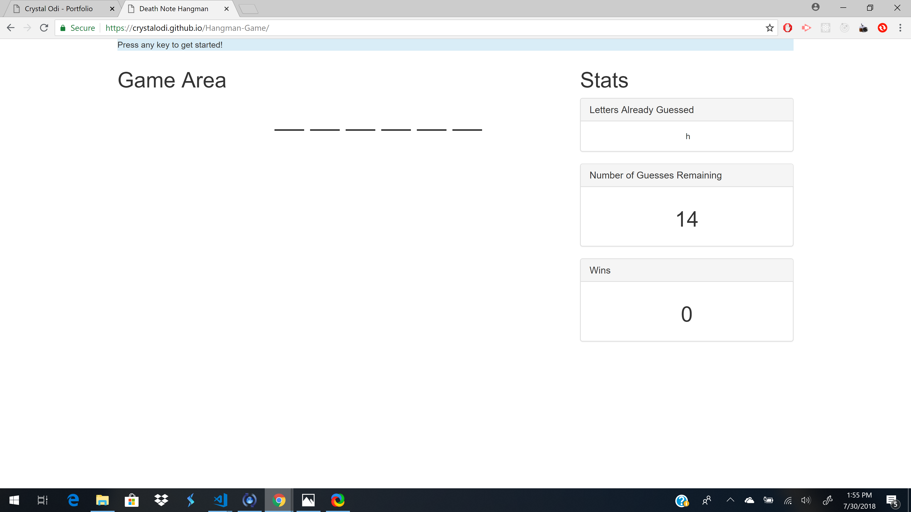
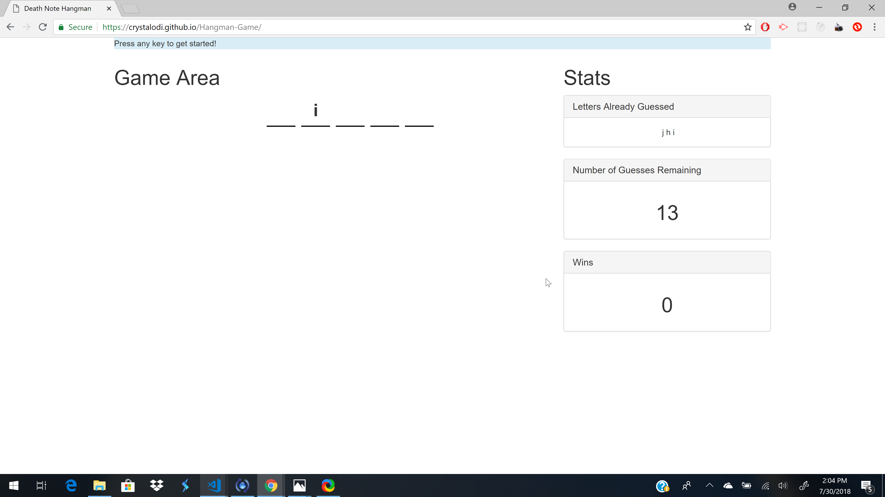
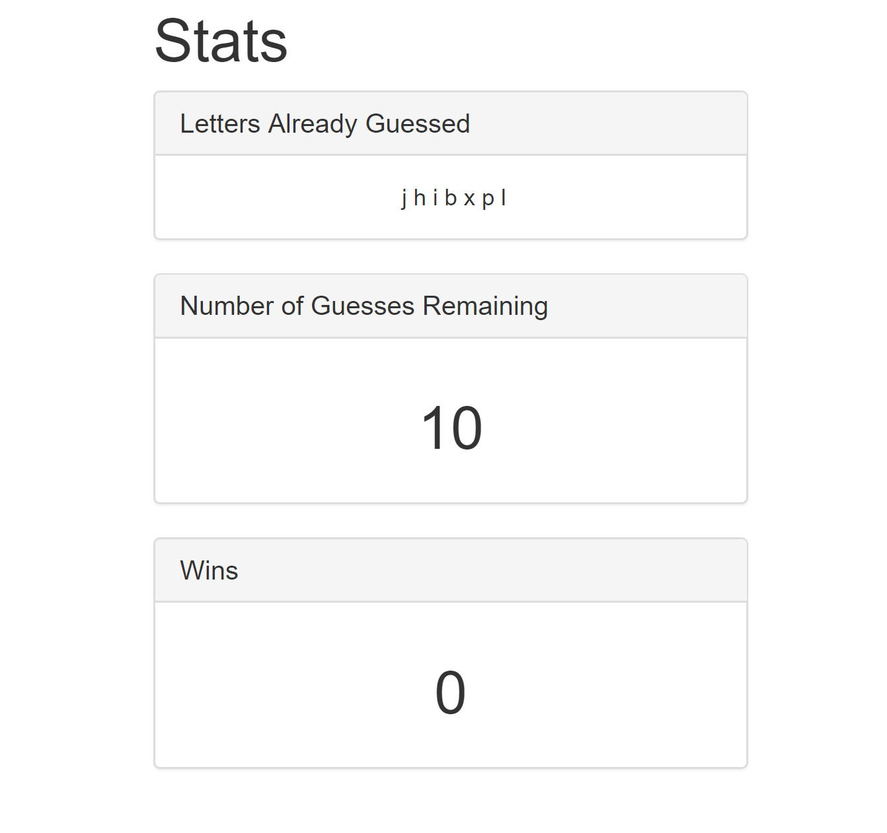
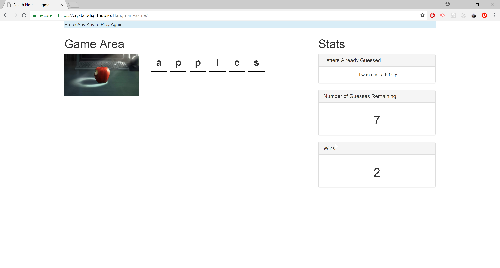
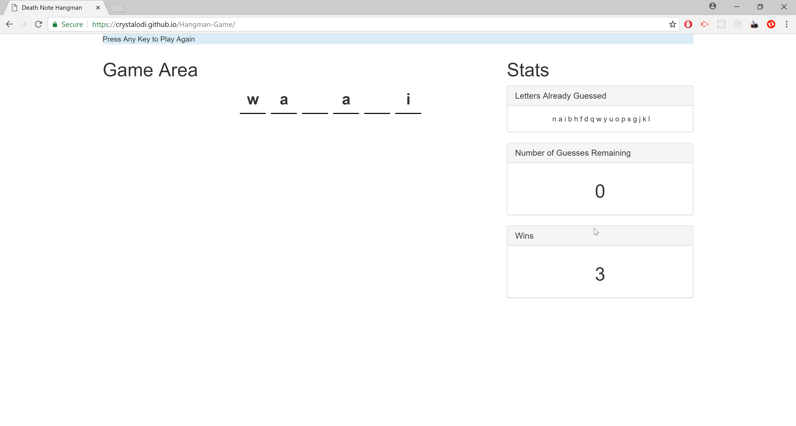

# Death Note Hangman Game

This hangman game will allow users to guess the names, items, and concepts associated with the popular anime series Death Note. 

## How to Play

### Rules

1. Users will have 15 tries to guess the word correctly using their keyboard
2. Non Letter Characters do not count towards the number of guesses alloted.
3. You can't guess the same letter more than once.
4. Alloted number of guesses decrements by one if the letter guessed is not in the selected word.

To Start the game, press any key on your keyboard. Blank spaces for the characters in the selected word will appear in the center of the screen. 

If the user guesses a letter that's in the chosen word, the letter will appear in the space(s) in the "Game Area" panel. Each letter guessed will be displayed under the "Letters Already Guessed" panel.

For each wrong guess, then the number of guesses will be decremented by one and displayed to the user in the "Number of Guesses" panel.

If the user is able to guess the word before the number of allotted guesses is zero, then a picture describing the word will display right next to the "Game Area" section. The number in the "Wins" panel will be incremented and the user will be able to press any key to start another round where a new word will be chosen.

If the user is not able to guess the word before the number of alloted guesses is zero, then no picture will display, and the user will be able to press any key to start another round.

## Code
Each word is stored in an array of objects containing the word and image associated with the word. Each time the user presses a key to start a new round, a random integer between 0 and the length of the array - 1 and is used to select the word from the array.
<!-- Add screenshot or code snippet--->

For each key press that is a letter that hasn't been guessed already and the number of guesses left is greater than 0, a for loop iterates through the selected word to check if the letter is in the word. Case does not matter.
<!-- Add screenshot of code snippet--->

Every letter guessed is added to an array and iterated over to display in the "Guessed Letters" section.
<!-- Add screenshot of code snippet--->

When there are no guesses left, the  url of the image populated for each word in the array of objects will be used to display a picture next to the game area.
<!-- Add screenshot of code snippet--->

## Technologies Used
* Javascript
* HTML5
* CSS

