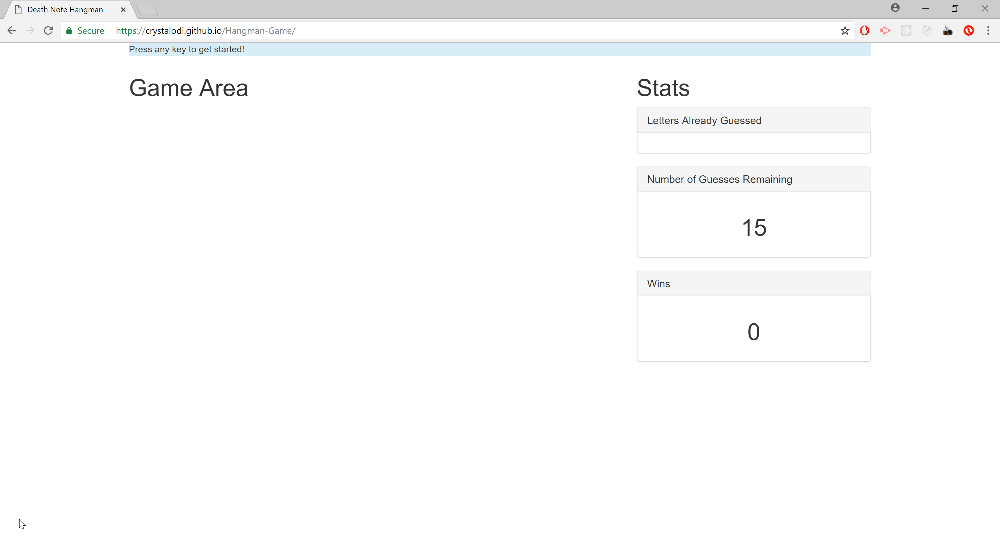

# Death Note Hangman Game

This hangman game will allow users to guess the names, items, and concepts associated with the popular anime series Death Note.

## Live Version

Go [here](http://crystalodi.github.io/Hangman-Game/) to view the app. 

## About the Application

## Getting Started

These instructions will get you a copy of the project up and running on your local machine.

### Prerequisites

Install the following programs if they aren't on your local machine.

GIT - https://git-scm.com/book/en/v2/Getting-Started-Installing-Git

### Installing

Open your terminal and clone [this](http://github.com/Hangman-Game/Hangman-Game.git) repository to your computer. 

```
git clone http://github.com/Hangman-Game/Hangman-Game.git

```

Navigate to the `/Hangman-Game` directory with your terminal

```
cd Hangman-Game
```

Open file explorer from the `/Hangman-Game` directory

```
explorer .
```

Open the `index.html` file by double clicking on it. The app will open in a web browser and should look like this:



### Folder Structure
After following the instructions in the installation section, the contents of the `/Hangman-Game` will look like this

```
│   index.html
│   README.md
│
└───assets
    ├───css
    │       reset.css
    │       style.css
    │
    ├───img
    └───javascript
            game.js
```
* `assets/css/reset.css` removes any default styling applied by web browsers
* `assets/css/style.css` Adds styling for letter spaces in game area. Adds bottom border so it looks like a blank.
* `assets/img` contains images associated with each word, which will display if user guesses the correct letters in less than alloted number of guesses.
* `assets/javascript/game.js` Contains logic to start the game.
    * When a key press is detected from `index.html`, game.js will pick a random word from an array of words and populate a space for each letter in the word in the game area container.

    * If key pressed is a letter and it's in the random word selected, that letter is populated in the Letters Already guessed section and populated in the space(s) for letters in game area.

    * If key pressed is a letter and it's not in the selected word, then letter is populated in the Letters Already guessed section and the number of guesses alloted is decreased by one.

* `index.html` Contains Social media sidebar and a section for adding autobiographal and professional details. Also contains navbar and header with name at top to navigate to other pages.

## How to Play

### Rules

1. Users will have 15 tries to guess the word correctly using their keyboard
2. Non Letter Characters do not count towards the number of guesses alloted.
3. You can't guess the same letter more than once.
4. Alloted number of guesses decrements by one if the letter guessed is not in the selected word.

To Start the game, press any key on your keyboard. Blank spaces for the characters in the selected word will appear in the center of the screen. 


If the user guesses a letter that's in the chosen word, the letter will appear in the space(s) in the "Game Area" panel. Each letter guessed will be displayed under the "Letters Already Guessed" panel.


For each wrong guess, then the number of guesses will be decremented by one and displayed to the user in the "Number of Guesses" panel.


If the user is able to guess the word before the number of allotted guesses is zero, then a picture describing the word will display right next to the "Game Area" section. The number in the "Wins" panel will be incremented and the user will be able to press any key to start another round where a new word will be chosen.


If the user is not able to guess the word before the number of alloted guesses is zero, then no picture will display, and the user will be able to press any key to start another round.


## Built With

* HTML
* JavaScript
* Bootstrap CSS

## Authors

* **Crystal Odi** - *Initial work* - [crystalodi](https://github.com/crystalodi)


## Acknowledgments

* [Death Note Wiki](http://deathnote.wikia.com/wiki/Main_Page) - for images.


